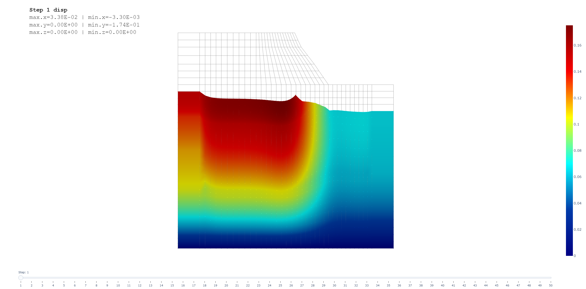

# EZSite_with_Openseespy
Rapid 2D site creation in openseespy
Aiming at simplify the modeling for site-structure integrated finite element models
## Example1 : [Dynamic_2D_Effective_Stress_Analysis_of_Slope](https://opensees.berkeley.edu/wiki/index.php?title=Dynamic_2D_Effective_Stress_Analysis_of_Slope)
The slope is modeled in two-dimensions and it is assumed that the slope is underlain by an elastic half-space. The free-field response of the soil is considered through the use of massive columns of soil with periodic boundary conditions located at both ends of the model. Four-node quadrilateral elements with both displacement and pore pressure degrees of freedom enable the model to track changes in pore pressure and effective stress during the course of the analysis. A Lysmer-Kuhlemeyer (1969) dashpot is utilized to account for the finite rigidity of the underlying elastic medium.

The Openseespy version of this example can be download here: [SlopeAnalysis2D.py](SlopeAnalysis2D.py).
The Origional Opensees example .tcl file can be download [here](https://opensees.berkeley.edu/wiki/images/5/54/SlopeAnalysis2Deff.tcl)

With the help of [opstool](https://github.com/yexiang1992/opstool)，the model and it's deformation can be plotted easily

|                             Model                             |                          Deformation                          |
| :-----------------------------------------------------------: | :-----------------------------------------------------------: |
|                                     |                                    |
